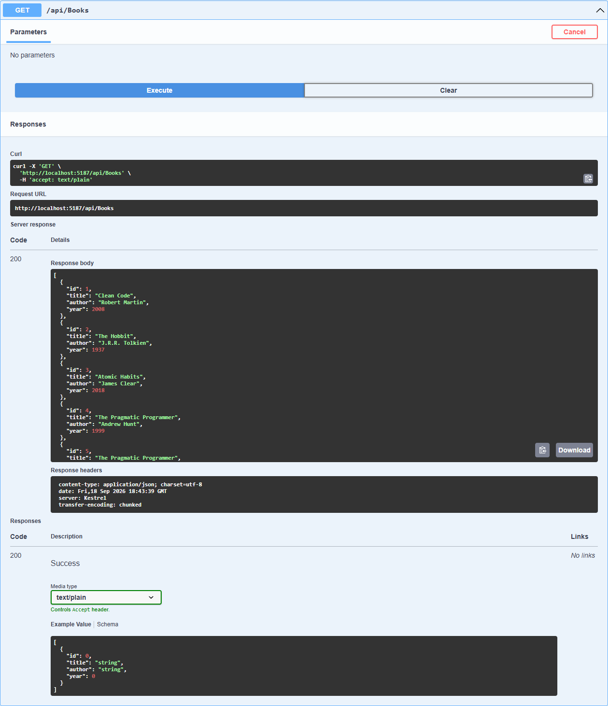
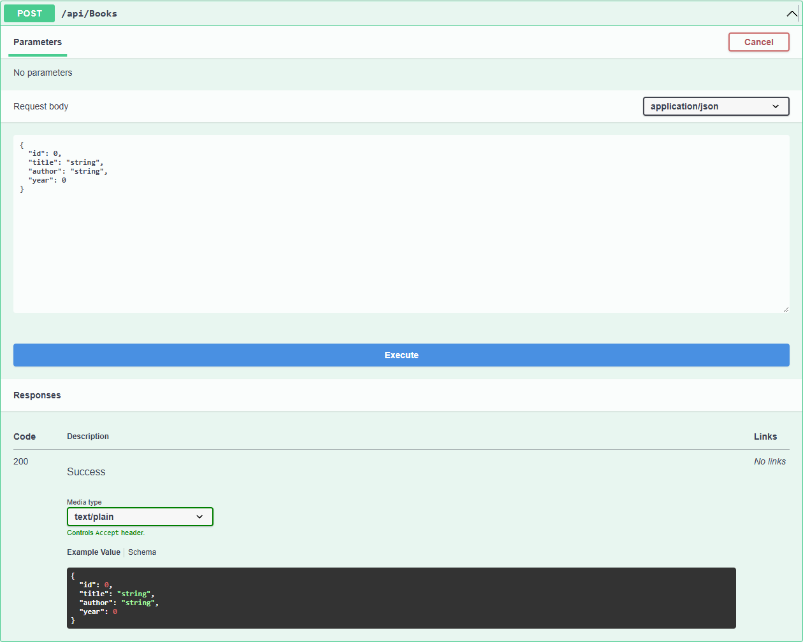

# WebApiHome2 — Модуль 02

## Краткий отчёт

Создан ASP.NET Core Web API для управления списком книг. Использованы C#, контроллер `BooksController`, маршрутизация и Swagger/OpenAPI. Данные хранятся в обычном списке `List<Book>` в памяти приложения. База данных не используется.

## Модель Book

Модель содержит четыре свойства: `Id`, `Title`, `Author`, `Year`.

## Реализованные endpoints

| Метод | Endpoint | Назначение | Результат |
|---|---|---|---|
| GET | `/api/books` | Получить список всех книг | `200 OK` |
| POST | `/api/books` | Добавить новую книгу из JSON | `200 OK` |

## Пример POST-запроса

```json
{
  "title": "Atomic Habits",
  "author": "James Clear",
  "year": 2018
}
```

## Скриншоты выполнения

### GET `/api/books`



### POST `/api/books`



## Вывод

В результате создан веб-сервис с двумя HTTP-методами. Через Swagger выполнен GET, добавлена новая книга через POST, после чего повторный GET подтвердил появление книги в списке.
