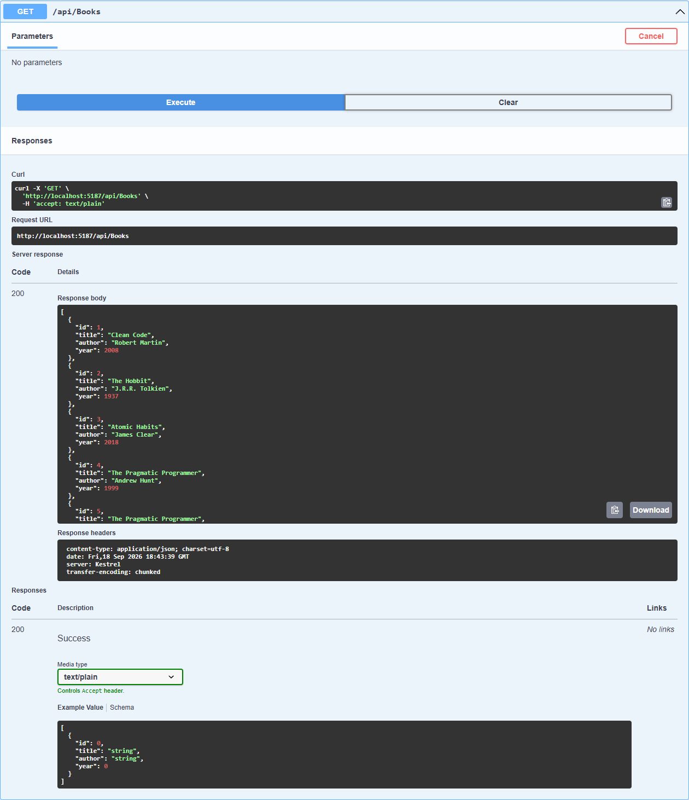
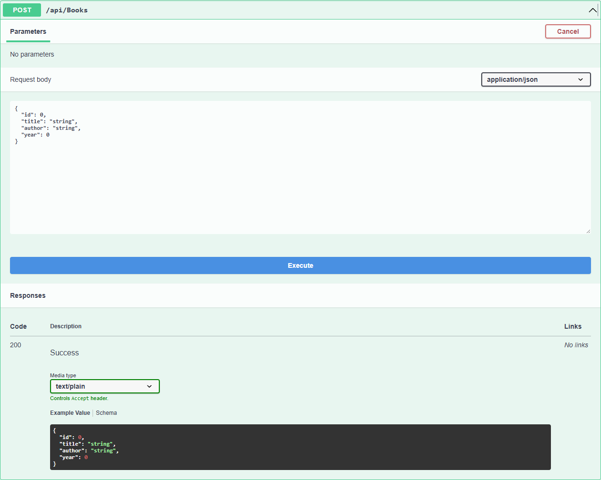

# Домашняя работа — Модуль 02: Books Web API

**CSE5032 · Разработка веб-сервисов · Модуль 02**

Задание — сделать API книг и показать обмен JSON через HTTP. Я описал книгу с ID, названием, автором и годом, подготовил начальные записи и реализовал получение списка и добавление. Через Swagger сначала получаю список, затем отправляю POST с новой книгой и повторяю GET. Новая запись появляется в ответе. Хранение учебное, в памяти, поэтому после перезапуска добавленные данные не сохраняются.

---

## Цель

Создать Web API для работы с книгами, запустить его и проверить операции через Swagger UI.

## Краткий отчёт

Проект создан на основе шаблона ASP.NET Core Web API с контроллерами. `BooksController` возвращает и добавляет книги; данные хранятся в статическом списке в памяти и сбрасываются при перезапуске приложения.

## Выполнение по шагам

| Шаг | Что сделано | Зачем |
|---|---|---|
| 1. Проект | Настроены контроллеры, Swagger и маршрутизация | Чтобы приложение предоставляло HTTP API и документацию для проверки |
| 2. Модель | Создан `Book` со свойствами `Id`, `Title`, `Author`, `Year` | Чтобы определить структуру книги |
| 3. Начальные данные | Добавлены две книги в список | Чтобы GET возвращал данные сразу после запуска |
| 4. Получение | Реализован `GET /api/books` | Получить весь список книг |
| 5. Добавление | Реализован `POST /api/books`; Id назначается приложением | Добавить книгу из JSON-запроса |
| 6. Проверка | По PDF после POST нужно повторить GET и убедиться, что добавленная книга появилась | Проверить изменение списка в рамках одного запуска |

## Модель `Book`

| Свойство | Тип | Назначение |
|---|---|---|
| `Id` | `int` | Идентификатор, назначается при добавлении |
| `Title` | `string` | Название книги |
| `Author` | `string` | Автор |
| `Year` | `int` | Год издания |

## Реализованные endpoint

| Метод | Endpoint | Назначение | Фактический ответ |
|---|---|---|---|
| `GET` | `/api/books` | Получить список книг | `200 OK` |
| `POST` | `/api/books` | Добавить книгу; Id назначается автоматически | `200 OK` |

## Пример JSON для POST

```json
{
  "title": "Clean Architecture",
  "author": "Robert C. Martin",
  "year": 2017
}
```

## Проверка и скриншоты

Сохранённые снимки показывают выполненные действия в Swagger, но их нужно сверять с текущей версией кода: POST-кадр показывает 201 Created, тогда как действующий BooksController возвращает 200 OK. Поэтому оба кадра оставлены как исторические и не подтверждают текущий HTTP-код.

### Шаг 1. Получение списка — `GET /api/books`



### Шаг 2. Добавление книги — `POST /api/books`



> Задание требует повторного GET после POST, чтобы подтвердить появление книги в списке. Отдельного снимка повторного GET в docs нет; сохранённый POST-кадр устарел по HTTP-коду.

## Вывод

Реализованы требуемые GET и POST с хранением в памяти. Повторный GET после POST подтверждает сохранение записи; сохранённый POST-кадр устарел по HTTP-коду.
